# Fluxos de Acesso: Cadastro e Login

## 1. Cadastro de Usuário
- **Método:** `POST`
- **Caminho:** `/usuarios`
- **Para que serve:** Cria uma nova conta de cliente no sistema.
- **Quem pode acessar:** Público.
- **Headers necessários:** Nenhum.

**Corpo da requisição (JSON):**
\`\`\`json
{
  "nome": "João Silva",
  "email": "joao@email.com",
  "senha": "senha-segura-123"
}
\`\`\`

**Resposta de sucesso (HTTP 201 Created):**
\`\`\`json
{
  "id": 2,
  "nome": "João Silva",
  "email": "joao@email.com",
  "tipo": "CLIENTE"
}
\`\`\`

**Erros possíveis:**
- `400 Bad Request`: "Nome, email e senha são obrigatórios" (Campos vazios)
- `400 Bad Request`: "O email informado é inválido" (Falta de '@')
- `400 Bad Request`: "A senha deve ter pelo menos 6 caracteres"
- `409 Conflict`: "Email já cadastrado"

**Teste:**
1. 200 OK - Cadastro realizado com sucesso.
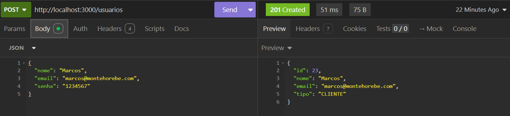

2. 400 Bad Request - Campos obrigatórios não preenchidos.
- Nome ausente
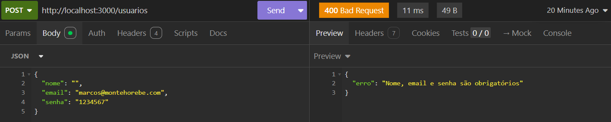
- Email ausente
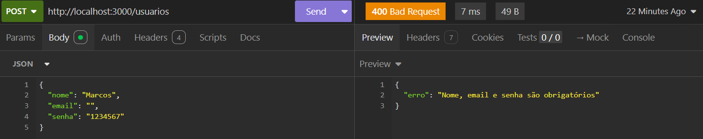
- Senha ausente
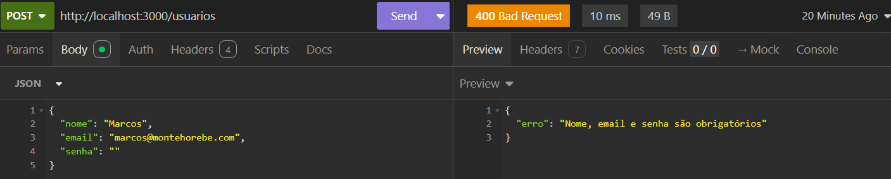
- Email inválido
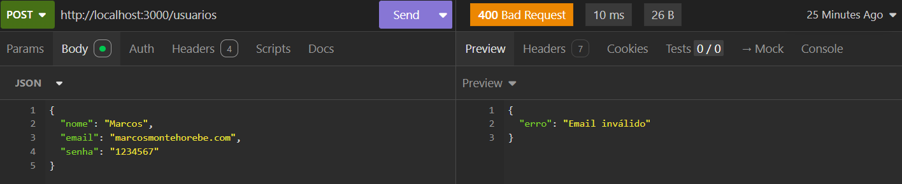
- Senha com menos de seis caracteres
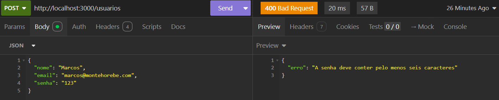
---

## 2. Login de Usuário
- **Método:** `POST`
- **Caminho:** `/login`
- **Para que serve:** Autentica um usuário existente.
- **Quem pode acessar:** Público.
- **Headers necessários:** Nenhum.

**Corpo da requisição (JSON):**
\`\`\`json
{
  "email": "joao@email.com",
  "senha": "senha-segura-123"
}
\`\`\`

**Resposta de sucesso (HTTP 200 OK):**
\`\`\`json
{
  "id": 2,
  "nome": "João Silva",
  "email": "joao@email.com",
  "tipo": "CLIENTE"
}
\`\`\`

**Erros possíveis:**
- `400 Bad Request`: "Email e senha são obrigatórios"
- `401 Unauthorized`: "Email ou senha inválidos"

**Testes**
- Login administrador
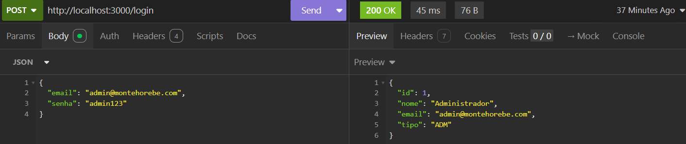

- Login cliente
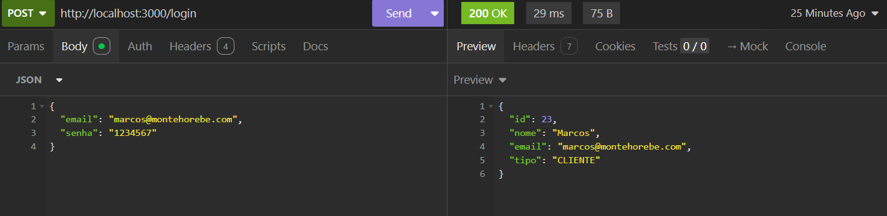

- 400 Bad Request - Campos obrigatórios não preenchidos.
- Email ausente
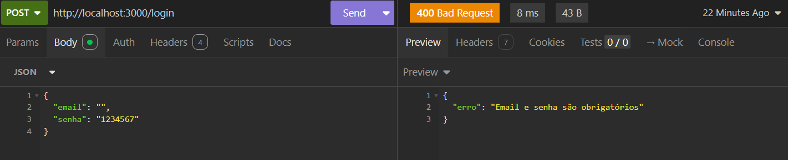
- Senha ausente
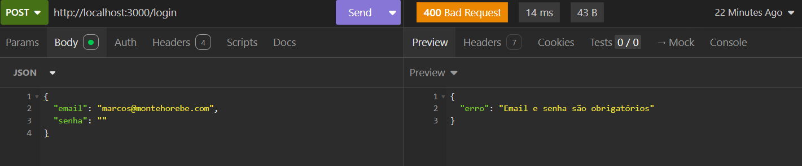

- 401 Unauthorized - Email ou senha inválidos
- Email incorreta
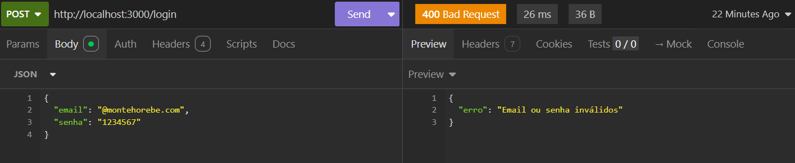
- Senha incorreta
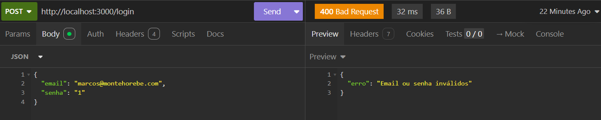